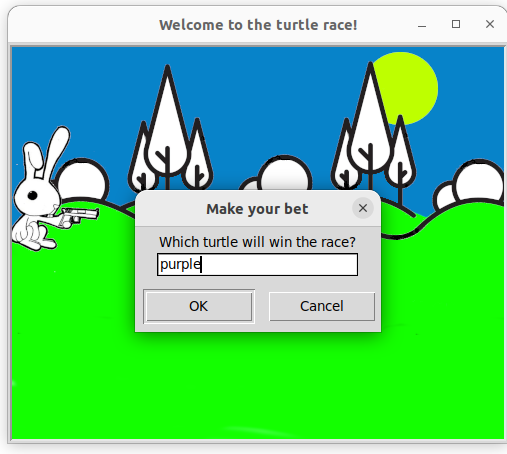
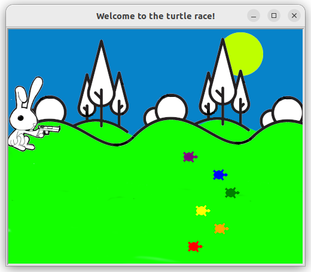

## Turtle Race

A randomly simulated turtle race.     
The turtles race across the screen, with the first one to reach the top being declared the winner.
###### It's a part of the **#100DaysOfCode** challenge by *Angela Yu*. ######    


#### Prerequisites
You will need the following software to run the Turtle Race:
 - [Python 3](https://www.python.org/downloads/)

#### Installation
To get started with the **Turtle Race**, follow these steps:

1. **Clone** the repository:

```sh
git clone https://github.com/resole79/turtle_race.git
```

2. **Run** the **main.py** file:

```sh
python main.py
```

#### File Structure   
 - **main.py**: Main program.


#### **Usage**

Ask the user to input:
 - Which turtle will win the race

- Color of turtle     
```py
color = ["red", "orange", "yellow", "green", "blue", "purple"]      
```




## **Credit**

Author : Emilio Reforgiato (resole79)

##
<p align="right"><a href="https://www.linkedin.com/in/emilio-reforgiato/" target=”_blank” ></a></p>


